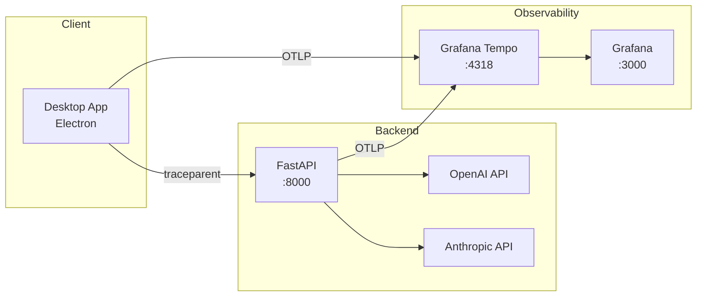

# LLM Observability 구축 경험 - 트레이싱과 모니터링

현재 팀에서는 LLM 서비스 관련 프로젝트를 진행하고 있다.

기존에도 Prometheus, Loki, Grafana 기반의 모니터링 스택은 구축되어 있어, 메트릭과 로그 가시성은 어느정도 확보된 상태였다.

다만, 실제 운영 환경에서 더 필요해진 것은 요청 단위의 흐름을 추적할 수 있는 트레이싱, 그리고 LLM 호출 자체를 들여다 볼 수 있는 모니터링 도구였다.

특히 LLM 서비스에서는 단순히 API 응답 시간만 보는 것으로는 부족하다. 어떤 요청의 어떤 파라미터에서 호출된 모델이 얼마나 토큰을 사용했는지를 확인할 수 있어야 운영 판단을 내릴 수 있기 때문이다.

마침 Datadog 측에서 도입 제안이 들어와 검토를 진행했지만, 팀 규모가 스타트업이기도 하고, Agent / Pod 단위 과금, APM, LLM, RUM 등 필요한 기능을 고려했을 때 전체 비용이 꽤 크게 발생할 것 같았다.

이미 기본적인 Grafana 스택을 운영하고 있는 상황에서, 우선은 상용 SaaS를 바로 도입하기보다 오픈소스 기반으로 직접 구축이 가능한지 검증해보는 방향이 더 나을 것 같다고 판단했다.

그래서 이번 PoC 에서는 요청 트레이싱과 LLM Observability를 함께 구성하는 것을 목표로 잡았다.

요청 트레이싱은 Grafana Tempo를 사용했다. 기존에 Grafana를 운영 중이었기 때문에 연동이 쉬웠기 때문이다.

LLM Observability는 OpenLLMetry 를 적용해 보았다. Langfuse 처럼 더 풍부한 기능을 제공하는 도구들도 있었지만, 이번 PoC 에서 가장 우선순위가 높았던 것은, 요청을 추적하고 그 요청의 파라미터에 따라 LLM 토큰 사용량과 지연 시간을 확인하는 것이었다. 프롬프트 관리 기능보다는, 현재 서비스에 필요한 최소한의 LLM 가시성을 빠르게 확보하는 데 초점을 맞췄다.

비용과 운영 복잡도도 중요한 고려 사항이었다. Langfuse 역시 셀프 호스팅이 가능하지만, ClickHouse 를 포함해 함께 구성해야 할 시스템이 적지 않았다. 이전에 Sentry를 셀프 호스팅 하면서도 ClickHouse 등 여러 컴포넌트를 함께 운영해야 했고, 그 과정에서 4 CPU급 워커 노드를 2대 이상 고려해야 할 정도로 리소스 부담이 있었던 경험이 있었다.

이번 PoC 에서는 기존 스택 위에 비교적 가볍게 얹을 수 있고 빠르게 검증 가능한 조합을 선택했다.

## 기술 스택

- Frontend: Electron (TypeScript)
- Backend: FastAPI (Python)
- Tracing: OpenTelemetry + Grafana Tempo
- LLM Monitoring: OpenLLMetry (Traceloop SDK)

## OpenTelemetry와 OpenLLMetry

OpenTelemetry는 CNCF(Cloud Native Computing Foundation)에서 관리하는 관측 가능성(Observability) 표준이다.

분산 시스템에서 요청의 흐름을 추적(Trace)하고, 시스템 상태를 측정(Metric)하며, 로그를 수집(Log)하는 통합된 방법을 제공한다. 특정 벤더에 종속되지 않고, Tempo, Jaeger, Zipkin 등 다양한 백엔드와 호환된다.

Datadog 같은 상용 솔루션을 쓰면 처음엔 빠르게 시작할 수 있지만, 비용이 늘어나거나 벤더를 바꾸고 싶을 때 마이그레이션 비용이 크다. OpenTelemetry를 쓰면 애플리케이션 코드는 그대로 두고 백엔드만 교체할 수 있다.

### OpenLLMetry - LLM 전용 계측

OpenTelemetry는 범용 표준이다 보니, HTTP 요청이나 데이터베이스 쿼리는 잘 추적하지만 LLM 호출에 특화된 기능은 없다.

OpenLLMetry(Traceloop SDK)는 OpenTelemetry 위에 구축된 LLM 전용 계측 라이브러리다. OpenAI, Anthropic, LangChain 같은 LLM 프레임워크를 자동으로 감지해서 토큰 사용량, 모델 정보, 프롬프트 같은 LLM 특화 데이터를 OpenTelemetry span에 담아준다.

```
OpenLLMetry (LLM 자동 계측)
    ↓
OpenTelemetry (범용 tracing 표준)
    ↓
OTLP (전송 프로토콜)
    ↓
백엔드 (Tempo, Jaeger 등)
```

OpenLLMetry가 생성한 span도 결국 OpenTelemetry 표준을 따르기 때문에, 어떤 OpenTelemetry 호환 백엔드에도 전송할 수 있다.

## Grafana Tempo

Tempo는 Grafana Labs에서 만든 분산 트레이싱 백엔드다.

Jaeger나 Zipkin 같은 기존 트레이싱 도구들은 trace를 빠르게 검색하기 위해 메타데이터를 인덱싱하는데, 이 과정에서 스토리지 비용이 크게 증가한다. Tempo는 다른 접근을 취한다. 인덱싱을 최소화하고, Object Storage(S3, GCS 등)에 저렴하게 저장한다.

Tempo 자체적으로 TraceQL을 통해 trace 검색이 가능하고, Grafana의 다른 데이터소스와도 자연스럽게 연동된다. 예를 들어 Loki에서 에러 로그를 찾으면 거기 포함된 trace ID를 클릭해서 Tempo로 바로 점프할 수 있다.

우리가 Tempo를 선택한 이유는:
1. **기존 Grafana 스택과 통합**: Loki, Prometheus와 같은 데이터소스에서 trace로 바로 연결
2. **낮은 운영 비용**: 별도 검색 인덱스 없이 Object Storage만으로 동작
3. **TraceQL**: SQL 같은 쿼리 언어로 trace 필터링, 집계, 통계 생성 가능

Tempo 2.0부터는 TraceQL Metrics 기능도 지원해서, trace 데이터를 기반으로 RED 메트릭(Rate, Error, Duration)을 자동 생성할 수 있다. 예를 들어 `{ status=error }` 같은 쿼리로 에러율을 계산하거나, 응답 시간 P95를 구할 수 있다.

## 아키텍처



사용자가 요청을 보내면, 백엔드는 여러 LLM을 병렬로 호출하고 결과를 반환한다. FE에서 BE까지, 그리고 각 LLM 호출까지 전체 흐름을 하나의 trace로 연결해서 추적한다.

## 구현 과정

### 1. 백엔드부터 시작

LLM 호출이 실제로 일어나는 곳이 백엔드이기 때문에, 여기서부터 계측을 시작했다.

처음에는 OpenLLMetry(Traceloop SDK)가 자동으로 LLM 호출을 계측해줄 거라 기대했다. 실제로 OpenAI나 Anthropic SDK를 쓰면 별도 코드 없이도 트레이스가 생성되는 것으로 문서에 나와 있었다.

```python
from traceloop.sdk import Traceloop

Traceloop.init(
    app_name="my-llm-service",
    api_endpoint="http://localhost:4318",
)
```

하지만 막상 적용해보니 LLM 호출이 트레이스에 잡히지 않았다.

원인은 사용하는 API가 비교적 최신 버전이라서, OpenLLMetry가 아직 해당 API들을 지원하지 않았기 때문이었다. 자동 계측이 안 되니 수동으로 span을 생성해야 했다.

```python
from openai import AsyncOpenAI
from opentelemetry import trace
from opentelemetry.trace import SpanKind

client = AsyncOpenAI()
tracer = trace.get_tracer("llm.service")

async def call_llm_with_tracing(model: str, messages: list[dict]):
    with tracer.start_as_current_span(
        f"openai.{model}",
        kind=SpanKind.CLIENT,
        attributes={
            "gen_ai.system": "openai",
            "gen_ai.request.model": model,
            "gen_ai.operation.name": "chat",
        },
    ) as span:
        response = await client.chat.completions.create(
            model=model,
            messages=messages,
        )

        # 토큰 사용량 기록
        span.set_attribute("gen_ai.usage.input_tokens", response.usage.prompt_tokens)
        span.set_attribute("gen_ai.usage.output_tokens", response.usage.completion_tokens)

        return response
```

OpenTelemetry는 GenAI Semantic Conventions라는 표준 속성을 정의하고 있다. `gen_ai.system`, `gen_ai.request.model`, `gen_ai.usage.input_tokens` 같은 속성을 지정하면, 나중에 Grafana에서 모델별, 토큰별로 필터링하고 집계할 수 있다. 이 표준을 따르면 도구나 백엔드를 바꿔도 일관된 방식으로 데이터를 분석할 수 있다.

### 2. 분산 트레이싱 - FE와 BE 연결

백엔드에서 LLM 호출을 추적하는 것까지는 성공했지만, 사용자의 요청이 백엔드에서 어떻게 처리되었는지를 연결해서 보려면 FE-BE 간 분산 트레이싱이 필요했다.

분산 트레이싱의 핵심은 W3C Trace Context 표준이다. FE에서 API를 호출할 때 `traceparent` 헤더를 포함하면, 서비스 경계를 넘어서도 같은 trace로 연결된다.

```
traceparent: 00-0af7651916cd43dd8448eb211c80319c-b7ad6b7169203331-01
             ──  ────────────────────────────────  ────────────────  ──
             버전        trace-id (32자)            parent-id (16자)  flags
```

FE(Node.js 환경)에서는 OpenTelemetry SDK로 트레이서를 초기화하고, API 요청 시 현재 span의 context를 `traceparent` 헤더로 전달한다.

```typescript
import { NodeTracerProvider } from '@opentelemetry/sdk-trace-node'
import { OTLPTraceExporter } from '@opentelemetry/exporter-trace-otlp-http'
import { trace } from '@opentelemetry/api'

// 트레이서 초기화
const provider = new NodeTracerProvider({
  resource: resourceFromAttributes({
    'service.name': 'my-llm-client',
  }),
  spanProcessors: [new BatchSpanProcessor(new OTLPTraceExporter())]
})
provider.register()

// API 요청 시 traceparent 헤더를 생성해서 전달
function createTraceparentHeader(): string | null {
  const currentSpan = trace.getActiveSpan()
  if (!currentSpan) return null

  const ctx = currentSpan.spanContext()
  return `00-${ctx.traceId}-${ctx.spanId}-01`
}

const headers = {
  'Content-Type': 'application/json',
  'traceparent': createTraceparentHeader()
}
```

BE에서는 FastAPI Instrumentation을 추가하면, 들어오는 `traceparent` 헤더를 자동으로 파싱해서 FE의 trace context를 이어받는다.

```python
from opentelemetry.instrumentation.fastapi import FastAPIInstrumentor

app = FastAPI()
FastAPIInstrumentor.instrument_app(app)
```

이렇게 하면 FE에서 생성된 span과 BE에서 생성된 span이 같은 trace-id로 묶인다. Grafana에서 한 요청을 추적하면 FE → BE → LLM 호출까지 전체 흐름을 볼 수 있게 된다.

```
llm.user_request (FE)  ────────────────────────────────────────  3.2s
  └── POST /api/generate (BE)  ────────────────────────────────  3.1s
        └── llm.generate  ─────────────────────────────────────  3.0s
              ├── anthropic.claude-sonnet-4-5  ─────────────────  1.8s
              │     input_tokens: 230, output_tokens: 89
              ├── openai.gpt-4o  ──────────────────────────────  2.1s
              │     input_tokens: 245, output_tokens: 92
              └── anthropic.claude-haiku  ─────────────────────  0.9s
                    input_tokens: 230, output_tokens: 85
```

이런 식으로 하나의 trace ID로 전체 요청 흐름을 추적할 수 있다. 어느 LLM이 느렸는지, 토큰을 얼마나 사용했는지 한눈에 파악된다.

### 3. 운영 지표 추가

트레이스만으로도 개별 요청을 분석하기엔 충분했지만, 운영 관점에서는 통계가 필요했다.

"오늘 어떤 모델이 가장 많이 쓰였나?", "평균 응답 시간이 얼마나 되나?", "토큰 사용량은 어느 정도인가?"

이런 질문에 답하려면 trace를 집계해서 메트릭으로 만들어야 한다.

Grafana Tempo는 TraceQL이라는 쿼리 언어를 제공한다. TraceQL로 trace를 필터링하고 집계할 수 있다.

```traceql
# 모델별 요청 수
{ name=~"anthropic.*|openai.*" } | count_over_time() by (span.gen_ai.request.model)

# P95 응답 시간
{ name="llm.generate" } | quantile_over_time(duration, 0.95)

# 토큰 사용량 합계
{ span.gen_ai.usage.input_tokens != nil }
  | sum_over_time(span.gen_ai.usage.input_tokens) by (span.gen_ai.request.model)
```

이런 쿼리를 Grafana 대시보드에 패널로 만들어서 실시간으로 모니터링할 수 있다.

## Grafana 대시보드

운영에 필요한 핵심 지표를 한눈에 볼 수 있는 대시보드를 구성했다.

**성능 메트릭**
- 요청 처리량 (시간당)
- 응답 시간 분포 (P50, P95, P99)
- 평균 First Response Time
- 에러율

**LLM 사용 분석**
- 모델별 요청 분포
- 모델별 평균 응답시간
- 토큰 사용량 추이 (Input/Output)

**사용 패턴**
- 기능별 사용 분포
- 시간대별 요청 히트맵

**문제 감지**
- 최근 느린 요청 Top 10

대시보드를 보면서 "Claude Haiku가 Sonnet보다 3배 빠른데 품질 차이가 적다면 Haiku 비율을 늘려볼까?", "오후 2~5시에 요청이 몰리니 이 시간대에 리소스를 좀 더 확보해야겠다" 같은 판단을 할 수 있게 되었다.

## 운영 상의 이점

### 1. 비용 절감

Datadog LLM Observability를 도입했다면 월 ~400만원이 예상되었는데, 기존 Grafana 스택을 활용해서 추가 비용 없이 구축했다.

### 2. 문제 해결 속도 개선

사용자가 "응답이 너무 느려요"라고 제보하면, 예전에는 로그를 뒤지면서 추정할 수밖에 없었다.

이제는 Grafana에서 해당 시간대 느린 요청을 찾아 trace를 열어보면, 어느 LLM이 느렸는지, 네트워크가 문제였는지, 프롬프트가 너무 길었는지 바로 파악할 수 있다.

### 3. 데이터 기반 의사결정

"어떤 모델을 주력으로 쓸까?", "비용을 줄이려면 어떤 최적화를 해야 할까?" 같은 질문에 감이 아니라 데이터로 답할 수 있게 되었다.

모델별 평균 응답 시간, 토큰 사용량, 에러율을 보면서 트레이드오프를 판단할 수 있다.

## 한계와 개선 방향

### 1. 프롬프트 버전 관리 부족

현재 구성에서는 토큰 사용량이나 응답 시간은 추적하지만, 프롬프트 자체의 버전 관리는 안 된다.

"어제 프롬프트를 수정했는데 품질이 떨어졌나?" 같은 질문에 답하려면 Langfuse 같은 도구가 더 적합할 수 있다.

다만 현재로서는 프롬프트 변경이 잦지 않고, Git으로 코드 버전 관리가 되기 때문에 당장 필요하진 않았다.

### 2. 비용 추정 자동화

토큰 사용량은 집계하지만, 실제 비용으로 환산하는 건 수동이다.

모델별 가격표를 관리하고 자동으로 일/주/월 비용을 계산해주는 기능이 있으면 좋겠다는 피드백이 있었다. 이 부분은 별도 스크립트나 대시보드 패널로 추가할 예정이다.

### 3. 알림 설정

현재는 대시보드를 수동으로 확인해야 한다.

P95 응답 시간이 5초를 넘거나, 에러율이 5%를 넘으면 Slack 알림을 보내는 등의 자동화가 필요하다. Grafana Alerting을 통해 구성 가능하다.

## 마무리

이번 PoC를 통해 OpenTelemetry + Grafana Tempo 조합으로도 충분히 실용적인 LLM Observability를 구축할 수 있다는 걸 확인했다.

물론 Datadog이나 Langfuse 같은 전문 솔루션에 비하면 기능이 부족한 부분도 있지만, 팀 규모와 현재 필요한 기능을 고려하면 적절한 선택이었다고 생각한다.

특히 OpenTelemetry는 표준 기반이라서, 나중에 요구사항이 늘어나면 백엔드를 Jaeger나 다른 도구로 바꾸거나, Datadog으로 마이그레이션하더라도 애플리케이션 코드 변경이 최소화된다는 점이 매력적이었다.

앞으로는 프롬프트 A/B 테스트나 품질 평가 같은 기능이 필요해질 수도 있는데, 그때는 Langfuse 같은 도구를 추가로 검토해볼 생각이다.

다만 당장은 "요청 추적", "토큰 사용량 모니터링", "성능 분석"이라는 핵심 목표를 비용 효율적으로 달성했다는 점에서 만족스러운 결과였다.
