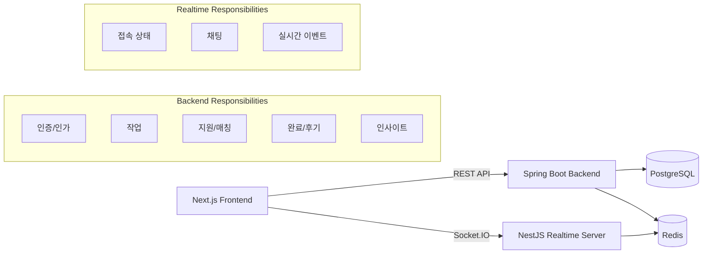
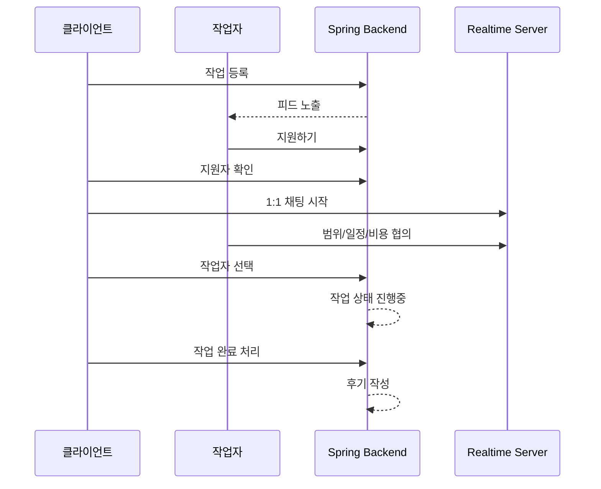

이번에 사이드 프로젝트로 업무 중개 플랫폼을 개발해 보았다. 이 글에서는 프로젝트의 배경과 구현 내용을 간략하게 정리하려 한다.

현재 개발 서버에 알파 버전이 배포 되어 있다.
[https://dev.ilit.app/](https://dev.ilit.app/)

---

일잇은 일을 맡기고 싶은 클라이언트와, 그 일을 해결할 수 있는 작업자를 연결하는 업무 중개 플랫폼이다. IT 프리랜서 일을 구하다 겪은 불편함을 해소하고자, 이 플랫폼을 개발하게 되었다.

기존 외주 플랫폼은 보통 전문가를 먼저 찾는 구조다. 의뢰자는 전문가 상품을 살펴보고, 포트폴리오를 비교하고, 견적을 문의한 뒤 답변을 기다린다. 규모가 크고 범위가 명확한 프로젝트라면 필요한 과정이지만, 빠르게 해결하고 싶고, 비교적 규모가 작은 일에는 이 플로우가 버겁게 느껴질 때가 있다.

일잇은 이 문제를 해결하려 했다.
클라이언트가 먼저 일을 올리고, 작업자는 피드에서 자신이 해결할 수 있는 일을 찾아 지원한다. 이후 채팅으로 범위와 일정, 비용을 조율하고 작업을 진행한다.

또한 실시간성을 플랫폼의 주요 속성으로 도입하였다. 신규 작업자의 경우 플랫폼에 리뷰와 포트폴리오가 없어 첫 일을 수주하기까지 허들이 높다. 일잇에서는 실시간 접속 상태를 우대해, 작업자가 마치 출근하듯 플랫폼에 접속하여 피드에 올라온 자신에게 적합한 업무를 수주받을 수 있는 구조를 계획했다.

더불어 링크드인과 같은 커리어 관리 플랫폼으로도 발전시키고자 하였다. 단순히 작업을 연결하는 데서 끝나지 않고, 완료 이력과 후기, 작업자가 올린 인사이트 게시물을 통해, 작업자가 사이드로 커리어를 쌓아갈 수 있는 구조를 만들고자 하였다.

## 기술 스택

- Frontend: Next.js, React, TypeScript
- Main Backend: Java, Spring Boot, JPA
- Realtime Server: NestJS, Socket.IO
- Database: PostgreSQL
- Cache / Realtime: Redis
- Infra: Terraform, Ansible, Docker Compose
- Analytics: Mixpanel

## 전체 구조

일잇은 프론트엔드, 메인 백엔드, 실시간 서버를 분리해서 구성했다.

일잇에서 채팅과 실시간 접속 상태는 서비스 기능의 메인이고, 사용 빈도도 높은 영역이다. 그래서 메인 비즈니스 로직은 Spring Boot 백엔드에서 구현하고, 실시간 채팅, 연결 관련 기능은 NestJS와 Socket.IO 서버로 분리했다.

채팅에서 기능과 연결되는 로직이 많아 realtime 서버를 외부 채팅 SaaS 대신 직접 구현하였다.
채팅방 생성과 시스템 메세지는 Spring 백엔드에서 처리하고, 사용자 대화 메세지는 NestJS realtime 서버에서 Socket.IO 로 처리한다.
두 서버는 같은 DB 의 `chat_rooms`, `chat_messages`테이블을 참조하며, Spring에서 생성한 시스템 메세지는 Redis pub/sub 을 통해 realtime 서버로 전달되어 해당 소켓 방에 브로드캐스트 된다.

## 인프라

알파 배포는 비용과 운영 단순성을 우선해 AWS Lightsail 1대와 Docker Compose 기반으로 구성했다.

인프라 리소스는 Terraform으로 관리했다. Lightsail 인스턴스, Static IP, Cloudflare DNS, 업로드용 S3 버킷, 백업용 S3 버킷을 코드로 정의했다.

서버 초기 설정은 Ansible로 자동화하여 Docker 설치, 방화벽 설정, 배포 설정 등을 처리 했다.

배포는 GitHub Actions에서 frontend, backend, realtime 각 이미지를 빌드해 GHCR에 push하고, Lightsail 서버에서는 이미지를 pull 받아 `docker compose up` 하는 방식이다. 서버에서 직접 빌드하지 않도록 하여 작은 인스턴스의 리소스 부담을 줄였다.

## 사용자 플로우

현재는 MVP만 구현된 알파 버전으로, 작업 등록/지원/완료, 실시간 접속/채팅 등 주요 기능들만 구현된 상태이다.

## 마무리

이제는 개발 경력이 쌓여, 혼자 프로젝트를 개발하는 건 딱히 어렵지 않다. 다만 어려운 점은 역시나 기획에 있다.
기능, 플랫폼 비전, 운영 등을 생각하다 보면, 중간에 개발했던 것들을 갈아 엎는 경우가 꽤 많고, 디자인도 세세한 부분을 고민하다 보면 뒤엎는 경우가 꽤 있기 때문이다.

이번 일잇 프로젝트를 하면서도 중간 중간 뒤엎는 상황이 꽤 있었다. 물론 기민하게 아이디어를 바로 반영할 수 있다는 장점은 있다. 어찌 보면 개발 조직에서 추구하는 애자일한 개발이고, 1인 개발의 장점 일수도...?

현재는 초기 버전이 완성된 상태이고, 운영에서 사용자 데이터가 쌓이는 것을 모니터링 한 후, 기능 보완 후 정식 오픈 할 예정이다.

자투리 시간에 개발하면서 기간은 대략 한달 조금 넘게 걸린 것 같다. 개발, 디자인, 기획, 법률 검토 등 다방면에서 LLM 을 적극 활용 하였다. AI 의 발전으로 프로젝트 진행하는 게 더욱 재밌어졌다.

---

<작업 상세>

<작업자 찾기>

<클라이언트 - 작업자 대화>
