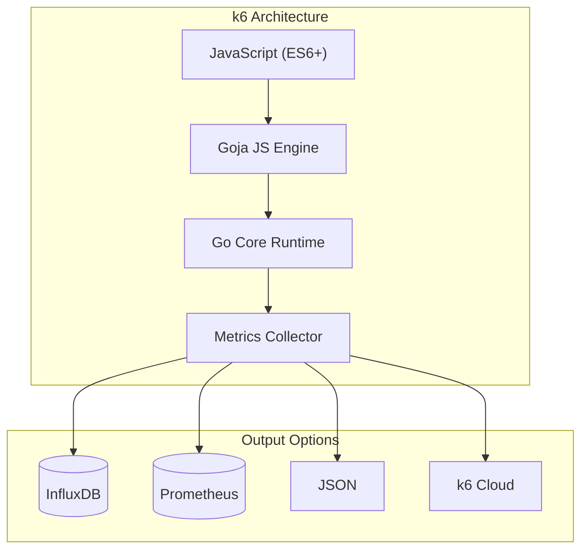

현재 맡고 있는 프로젝트에서 지원 사업 평가를 준비하면서, 서비스가 분당 500 요청 (500 RPM) 을 안정적으로 처리할 수 있는지 증명해야 했다.

평가 항목은 두 가지였다.

- 시스템 확장성: 부하 상황에서 목표 처리량 (500+ RPM)을 유지할 수 있는가
- 응답 속도: 주요 기능의 P95 응답 시간이 5초 이내로 유지 되는가

기존에는 부하 테스트 도구로 JMeter 를 주로 사용했지만, 이번에는 학습도 할 겸, 모던한 도구를 기술 조사 한 후 도입해 보기로 하였다.

### k6

[Load testing for engineering teams | Grafana k6](https://k6.io/)

k6는 Grafana Labs 에서 개발한 오픈소스 부하 테스트 도구이다.

평소 Grafana를 모니터링 대시보드로 활용하고 있었기 때문에 ‘Grafana 생태계의 부하 테스트 도구’ 라는 점에서 관심이 갔다.

k6의 아키텍처는 아래와 같다.



k6는 모던한 개발 아키텍처와 잘 맞는 테스트 도구라고 할 수 있다. 

CLI 중심으로 동작하여 Docker / Kubernetes 환경에서 동작 시킬 수 있고,

InfluxDB / Prometheus 로 내보낸 뒤 Grafana 에서 바로 시각화 할 수도 있다.

### Go 기반. 단일 바이너리와 높은 동시성

k6는 Go 언어로 작성된 단일 바이너리 형태의 도구다. 그렇다 보니, JVM이나 플러그인 등 복잡한 런타임 설정 없이 바로 실행할 수 있고, 컨테이너 환경에서도 가볍게 동작한다.

Go의 강점은 잘 알려진 것처럼 고루틴 기반의 높은 동시성 처리다.

k6는 이 특성을 활용해 수백~수천 개의 VU(Virtual User)를 효율적으로 스케줄링하며, 부하 테스트 도구 자체가 병목이 되는 상황을 최소화 한다.

이번 테스트에서도, 500 RPM 수준의 트래픽을 발생시키는 동안 k6 컨테이너의 리소스 사용량은 매우 안정적이었고,

테스트 대상 시스템의 성능을 왜곡하지 않는다는 점에서 신뢰성이 높았다.

### Javascript 작성 가능

k6의 테스트 스크립트는 Javascript(ES6) 로 작성한다.

별도의 설정 파일이나 복잡한 UI 조작 없이, 코드로 테스트 시나리오를 정의할 수 있다는 점이 큰 장점이었다. 

특히 실제 웹 서비스 로직을 작성 하듯이,

요청 보내는 파트 → 응답 검증(테스트) 파트 → 메트릭 정보 기록 파트

이 흐름 그대로 코드로 작성할 수 있었다. 또한 테스트 데이터 랜덤화/ 조건 분기 등도 서버 코드 작성하듯이 빠르게 작업해갈 수 있었다.

결과적으로 부하 테스트가 ‘일회성 세팅 작업’이 아니라, git 으로 관리되고 코드 리뷰도 할 수 있는 ‘테스트 코드’ 로 남는다는 점이 좋았다.

개발자로서 느낀 장점은, ‘테스트 도구를 새로 배운다’ 라기 보다는, ‘테스트 코드를 작성한다’ 라는 경험에 가까웠다는 점이었다.

### 테스트 환경 구성

이번 테스트에서는 docker compose 를 이용하여 환경 분리를 하였고, 아래 스택으로 구성하였다.

- k6 : 부하 테스트
- InfluxDB : k6 메트릭 저장
- Grafana : 테스트 데이터 시각화 및 분석
- Cloud Grafana : 서버 메트릭 정보

### 테스트 스크립트

이번 테스트 대상 API는 다음과 같은 특징이 있다.

AI 기반 문장 교정 기능이며, 요청에 3개의 LLM 교정 응답을 내려준다. (Fastest, Best, Random 3건)

- SSE 기반 스트리밍 응답
- 요청 1건당 외부 LLM 병렬 호출
- LLM 모델 응답 속도에 따라 전체 응답 시간이 달라짐

따라서 단순히 요청을 많이 보내는 것보다, 실제 운영 환경에서 발생하는 요청 패턴과 같이 보내는 것이 중요했다.

k6 테스트 스크립트는 크게 세 부분으로 나눌 수 있다.

- 옵션(options) : 부하 패턴과 성공 기준 정의
- 테스트 데이터: 실제 요청과 유사한 입력값
- 메인 / 각 시나리오 : 요청 → 검증 → 메트릭 기록

```jsx
export const options = {
  thresholds: {
    http_req_duration: ["p(95)<5000"], // P95 < 5초
    errors: ["rate<0.01"],              // 에러율 < 1%
  },
};
```

이번 테스트의 목표 지표는 http_req_duration 의 백분위 95였다. (P95)

평균 응답보다 대부분의 사용자가 체감하는 응답시간을 평가하기 위함이었고,

너무 빠르거나 혹은 너무 늦은 응답을 걸러내기 위함이었다.

테스트 데이터는 아래와 같이 하였다.

실제 사용자가 자주 교정 요청을 보내는 15자 이내 길이로 하였고,

맞춤법이나 띄어쓰기 오류가 섞인 입력으로 하였다.

```jsx
const sampleSentences = [
  "안녕하세요 반갑습니당",
  "오늘 날씨가 조아요",
  "맛있는거 먹고싶다",
  "회의일정 알려주세요",
  "감사합니당 수고하세요",
  "이메일 보내 주세요",
  "내일 뭐해요?",
  "보고서 검토부탁드려요",
  "저녁 뭐먹을까요",
  "수고 하셨습니다",
];
```

메인 테스트 로직은 이와 같다.

```jsx
export default function () {
  const sentence =
    sampleSentences[Math.floor(Math.random() * sampleSentences.length)];

  const payload = JSON.stringify({
    sentence_request: {
      input_sentence: sentence,
      language: "Korean",
    },
  });

  const res = http.post(`${API_URL}`, payload, {
    headers: { "Content-Type": "application/json" },
    timeout: "30s", // SSE 스트리밍 고려
  });

  const success = check(res, {
    "응답 200": (r) => r.status === 200,
    "5초 이내": (r) => r.timings.duration < 5000,
  });

  errorRate.add(!success);
}
```

여기서 중요한 점은, SSE 스트리밍 API라 하더라도 ‘요청 전체 완료 시간’을 기준으로 측정했다는 점이다.

아래와 같이 평가 기준을 충족하기 위한 시나리오를 구성했다.

```tsx
export const options = {
  scenarios: {
    load_test: {
      executor: "constant-arrival-rate",
      rate: 550, // 분당 550 요청. 10% 버퍼
      timeUnit: "1m",
      duration: "1m", // 1분간 테스트
      preAllocatedVUs: 50, // 사전 할당 VU
      maxVUs: 100, // 최대 VU (응답 느리면 자동 증가)
    },
  },
  thresholds: {
    http_req_duration: ["p(95)<5000"], // 95%가 5초 이내
    errors: ["rate<0.01"], // 에러율 1% 미만
  },
};
```

이 시나리오는 다음을 검증할 수 있다.

- 분당 500 요청을 유지할 수 있는가
- 부하 상황에서도 P95 응답이 5초 이내로 유지 되는가
- 에러가 발생 하는가

constant-arrival-rate 은 고정 도착률을 파악하기 위한 Executor 유형 중 하나로,

현재 목표인 ‘분당 500 요청’ 과 같이 정확한 처리량 목표가 있을 때 주로 사용 된다.


이 화면과 같이, `550/60 = 9.17` 목표 rate로 사전 할당된 50VU 가 조절되며 요청을 보낸다. (화면에서는 `17/50 VUs`)

응답이 목표 9.17 내에 잘 받아지고 있다면 VU 수준을 유지하다가, 응답이 느려진다면 VU를 늘려 목표 rate 를 유지한다.

### 테스트 결과 분석

위 테스트 시나리오를 기준으로, Kubernetes 백엔드 Pod 수를 변경해가며 테스트 하였다.

| Pod 수 | P95 응답 시간 | 500 RPM |
| --- | --- | --- |
| 1 | 6.1초 | 미충족 |
| 2 | 4.5초 | 충족 |
| 3 | 3.2초 | 충족 |

Pod가 3개일 때 기준을 충족 하였다.


수행 결과 로그는 아래와 같다.

```bash

         /\      Grafana   /‾‾/  
    /\  /  \     |\  __   /  /   
   /  \/    \    | |/ /  /   ‾‾\ 
  /          \   |   (  |  (‾)  |
 / __________ \  |_|\_\  \_____/ 

     execution: local
        script: sentencify/load-test.js
        output: InfluxDBv1 (http://influxdb:8086)

     scenarios: (100.00%) 1 scenario, 100 max VUs, 1m30s max duration (incl. graceful stop):
              * load_test: 9.17 iterations/s for 1m0s (maxVUs: 50-100, gracefulStop: 30s)

INFO[0062] ========== 테스트 결과 요약 ==========               source=console
INFO[0062] 총 요청 수: 551                                   source=console
INFO[0062] 평균 응답 시간: 2090.27ms                           source=console
INFO[0062] 최대 응답 시간: 5098.86ms                           source=console
INFO[0062] 95퍼센타일: 2674.92ms                             source=console
{
  "root_group": {
    "checks": [
      {
        "name": "응답 200",
        "path": "::응답 200",
        "id": "0260b45491bec6b03782afbf3bc94274",
        "passes": 551,
        "fails": 0
      },
      {
        "name": "5초 이내",
        "path": "::5초 이내",
        "id": "7722679f7a4200e971b8778b01fda9dd",
        "passes": 550,
        "fails": 1
      }
    ],
    "name": "",
    "path": "",
    "id": "d41d8cd98f00b204e9800998ecf8427e",
    "groups": []
  },
  "options": {
    "summaryTrendStats": [
      "avg",
      "min",
      "med",
      "max",
      "p(90)",
      "p(95)"
    ],
    "summaryTimeUnit": "",
    "noColor": false
  },
  "state": {
    "isStdErrTTY": true,
    "testRunDurationMs": 62187.748584,
    "isStdOutTTY": true
  },
  "metrics": {
    "http_req_receiving": {
      "type": "trend",
      "contains": "time",
      "values": {
        "avg": 2058.9268594936457,
        "min": 1300.732834,
        "med": 2081.572542,
        "max": 5071.237711,
        "p(90)": 2382.718418,
        "p(95)": 2643.7390559999976
      }
    },
    "data_sent": {
      "contains": "data",
      "values": {
        "count": 207264,
        "rate": 3332.875119607176
      },
      "type": "counter"
    },
    "iterations": {
      "type": "counter",
      "contains": "default",
      "values": {
        "rate": 8.860266090124451,
        "count": 551
      }
    },
    "vus_max": {
      "type": "gauge",
      "contains": "default",
      "values": {
        "value": 50,
        "min": 50,
        "max": 50
      }
    },
    "http_req_blocked": {
      "values": {
        "avg": 5.041467219600725,
        "min": 0.000292,
        "med": 0.001375,
        "max": 269.340542,
        "p(90)": 0.0085,
        "p(95)": 46.61706199999999
      },
      "type": "trend",
      "contains": "time"
    },
    "http_req_connecting": {
      "type": "trend",
      "contains": "time",
      "values": {
        "max": 58.890834,
        "p(90)": 0,
        "p(95)": 20.571354,
        "avg": 1.9721727150635209,
        "min": 0,
        "med": 0
      }
    },
    "data_received": {
      "type": "counter",
      "contains": "data",
      "values": {
        "count": 1541973,
        "rate": 24795.44661304441
      }
    },
    "http_req_tls_handshaking": {
      "type": "trend",
      "contains": "time",
      "values": {
        "p(90)": 0,
        "p(95)": 25.425207999999998,
        "avg": 2.420096399274047,
        "min": 0,
        "med": 0,
        "max": 63.595375
      }
    },
    "http_req_failed": {
      "type": "rate",
      "contains": "default",
      "values": {
        "rate": 0,
        "passes": 0,
        "fails": 551
      }
    },
    "http_reqs": {
      "type": "counter",
      "contains": "default",
      "values": {
        "count": 551,
        "rate": 8.860266090124451
      }
    },
    "http_req_duration{expected_response:true}": {
      "values": {
        "p(90)": 2414.663835,
        "p(95)": 2674.915534999998,
        "avg": 2090.26673164973,
        "min": 1329.754709,
        "med": 2115.797126,
        "max": 5098.862753
      },
      "type": "trend",
      "contains": "time"
    },
    "http_req_duration": {
      "type": "trend",
      "contains": "time",
      "values": {
        "med": 2115.797126,
        "max": 5098.862753,
        "p(90)": 2414.663835,
        "p(95)": 2674.915534999998,
        "avg": 2090.26673164973,
        "min": 1329.754709
      },
      "thresholds": {
        "p(95)<5000": {
          "ok": true
        }
      }
    },
    "http_req_waiting": {
      "type": "trend",
      "contains": "time",
      "values": {
        "min": 24.828667,
        "med": 30.074083,
        "max": 146.696667,
        "p(90)": 34.232041,
        "p(95)": 36.293541499999996,
        "avg": 30.954117549909288
      }
    },
    "iteration_duration": {
      "contains": "time",
      "values": {
        "avg": 2096.089314381126,
        "min": 1344.285793,
        "med": 2120.258501,
        "max": 5099.320585,
        "p(90)": 2418.652417,
        "p(95)": 2679.7770014999983
      },
      "type": "trend"
    },
    "vus": {
      "type": "gauge",
      "contains": "default",
      "values": {
        "value": 1,
        "min": 1,
        "max": 23
      }
    },
    "http_req_sending": {
      "values": {
        "min": 0.089459,
        "med": 0.356583,
        "max": 3.208125,
        "p(90)": 0.560542,
        "p(95)": 0.6277504999999999,
        "avg": 0.3857546061705989
      },
      "type": "trend",
      "contains": "time"
    },
    "checks": {
      "type": "rate",
      "contains": "default",
      "values": {
        "fails": 1,
        "rate": 0.9990925589836661,
        "passes": 1101
      }
    },
    "errors": {
      "type": "rate",
      "contains": "default",
      "values": {
        "rate": 0.0018148820326678765,
        "passes": 1,
        "fails": 550
      },
      "thresholds": {
        "rate<0.01": {
          "ok": true
        }
      }
    }
  }

running (1m02.2s), 000/050 VUs, 551 complete and 0 interrupted iterations
load_test ✓ [======================================] 000/050 VUs  1m0s  9.17 iters/s
```

### 병목 지점

테스트 중 서버 리소스 사용량을 Grafana 로 확인했다.

결론부터 말하자면, 예상한대로 서버 CPU 는 충분히 여유가 있었고, 병목은 서버 연산이 아니라 외부 호출 대기 (LLM 응답) 쪽에 있었다. 

CPU Utillisation 그래프를 보면 부하가 걸리는 구간에서도 CPU 사용률은 낮게 유지된다.

즉, 요청을 처리하는 동안 서버가 CPU 를 갈아넣고 있는 상태가 아니라, 대부분의 시간이 I/O 대기로 진행되고 있다는 점이다.


Memory 는 테스트 동안에도 크게 출러잉지 않고 안정적으로 유지 되었다.

다만, 현재 Request 보다 메모리 사용량이 2배 가까이 되고 있는데, 이는 staging 환경 구성 당시 메모리 사용량을 체크하지 못했던 부채가 남아 있는 것 같다.

실제 staging 운영상에는 문제 없겠지만, 이렇게 되면 스케줄링/리소스 관리 측면에서 손봐야 할 부분이다.


네트워크 트래픽도 폭발적이진 않았다. 테스트 중 수신 대역폭은 최대 약 60 kb/s, 송신 대역폭은 약 40kb/s 수준이었다.

분당 500 요청 (초당 8.3요청)을 기준으로 생각했을 때 1건당 약 1KB 정도의 네트워크 사용량으로 추측해 볼 수 있다. 이는 트래픽에 아주 미미한 정도이다. 


### HPA 와 단기 부하 테스트의 한계

해당 평가는 시스템 확장성 평가로, 단순히 ‘평소에 잘 동작하는 가’가 아니라, 트래픽이 몰리는 상황에서 목표 성능을 유지할 수 있도록 설계 되었는지를 평가하는 것이 목적이라 할 수 있다.

kubernetes 환경에서 HPA(horizontal Pod Autoscaler)는 사실상 기본 구성이다.

다만, 이번 평가 시나리오에서는 HPA 를 그대로 적용하기에 한계가 있었다.

HPA 는 기본적으로 다음 과정을 거쳐 동작한다.

- 매트릭 수집 (CPU, Memory 등)
- 일정 주기로 평균값 계산
- 스케일링 필요 여부 판단
- Pod 생성 및 Ready 전환
- (필요 시 NodeGroup 확장)

이 과정에서 일반적으로 최소 수 분 이상의 시간은 소요된다.

이번 테스트는 1분 이내의 단기 부하 테스트였기 때문에,

HPA 가 실제로 스케일 아웃을 완료하기까지의 시간을 고려하면 평가 시나리오에 적합하지 않다고 판단했다.

CPU 기반 HPA 는 LLM 서비스 특성을 충분히 반영하지 못한다.

이번 서비스는 다음의 특징을 갖고 있다.

- 요청 1건당 외부 LLM API 병렬 호출
- 서버는 대부분 외부 응답을 기다리는 상태
- CPU 사용량은 낮음. (그러나 응답 지연 시간은 큼)

실제 CPU 사용률은 부하 도중에도 6% 대에 머물렀으며,

이 구조에서는 CPU 기반 HPA 가 트리거 되지 않는 것이 당연한 결과였다.

### 선택한 전략. 사전 수동 스케일링

평가 목적은 ‘자동 스케일링 검증’ 이 아니라 ‘처리 가능한 지’이므로, 이번 테스트에서는 사전에 수동으 스케일링 전략을 선택했다. 

테스트 전에 예상 부하를 감당할 수 있는 Pod 수로 미리 확장한 뒤, 그 상태에서 검증 테스트를 실시했다.

```bash
# 테스트 전
kubectl scale deployment backend \
  -n sentencify-staging \
  --replicas=3
  
# 테스트
docker compose run --rm k6 run load-test.js
  
  
# 테스트 후 원복
kubectl scale deployment backend \
  -n sentencify-staging \
  --replicas=1
```

실제 Pod 수를 1개에서 3개까지 늘려가며 테스트 한 결과, Pod 수에 비례해 P95 응답 시간이 안정적으로 감소하는 것을 확인할 수 있었다.

### 마무리

이번 테스트를 통해 확인한 점은, ‘확장성’은 기능적 자동화 여부가 아니라 구조의 문제라는 것이다.

일반적으로 kubernetes 환경에서는 리소스 사용량을 기준으로 한 HPA 구성을 먼저 떠올리게 된다.

하지만 이번 평가에서는 부하에 따라 자동으로 Pod가 늘어났는지보다,

필요한 리소스를 투입했을 때 성능이 실제로 개선되는지를 확인하는 것이 더 중요했다.

특히 외부 LLM API를 호출하는 AI 기반 서비스에서는, 대시보드 상의 리소스 지표만으로는 응답 지연이나 사용자 관점의 시스템 부하를 판단하기 어려웠다.

실제 테스트에서도 CPU 사용률은 낮게 유지되었지만, 전체 응답 시간은 외부 LLM 응답 대기 시간에 의해 결정되었다.

Pod 수를 늘렸을 때 P95 응답 시간이 안정적으로 감소할 수 있었고, 현재 시스템이 수평 확장에 적합한 구조임을 확인할 수 있었다. 이번 평가에서는 이를 수치적으로 증명하는 데 집중했다.

### 부록. KEDA

[KEDA](https://keda.sh/)

앞선 테스트에서는 CPU / 메모리 기반의 오토스케일링이 LLM 서비스 특성과 맞지 않는다는 점을 확인했다.

이에, 다른 방법은 없을까 기술 조사를 해보았고, KEDA(Kubernetes Event-Driven Autoscaling) 을 발견했다.

KEDA는 이벤트 또는 외부 지표 기반으로 Pod를 확장할 수 있도록 해주는 Kubernetes 확장 도구다.

기존 HPA 가 CPU / 메모리 같은 리소스 지표에 의존하는 반면,

KEDA 는 다음과 같은 이벤트를 트리거로 사용할 수 있다

- 메시지 큐 길이 (RabbitMQ, kafka 등)
- Promethues 매트릭
- 커스텀 애플리케이션 지표

즉, 리소스 사용량이 아니라, 서비스의 상태를 기준으로 확장할 수 있다는 점이 주요 기능이다.

아래 예시는 P95 응답 시간이  X초를 넘으면 확장되는 예시이다.

Promethues 의 `http_request_duration_seconds_bucket` 매트릭을 참조하여,

최근 1분 기준 P95 응답 시간이 5초를 초과하면, Pod 수를 늘린다.

```yaml
apiVersion: keda.sh/v1alpha1
kind: ScaledObject
metadata:
  name: backend-latency-scaler
spec:
  scaleTargetRef:
    name: backend
  minReplicaCount: 1
  maxReplicaCount: 5
  triggers:
    - type: prometheus
      metadata:
        serverAddress: http://prometheus.monitoring:9090
        metricName: http_p95_latency
        threshold: "5"
        query: |
          histogram_quantile(
            0.95,
            sum(rate(http_request_duration_seconds_bucket[1m])) by (le)
          )

```

허나 실제 운용상에서는 신중해야 할 필요가 있다.

지연 기반 확장은 어찌보면 사후 대응과 같기 때문이다.

P95 응답 시간이 기준을 초과했다는 것은, 이미 사용자 체감 성능이 나빠진 이후라는 의미이다.

장애를 완화하는 점에서는 유효하겠지만, 부하를 사전에 예방하는 점에서는 한계가 있어 보인다.