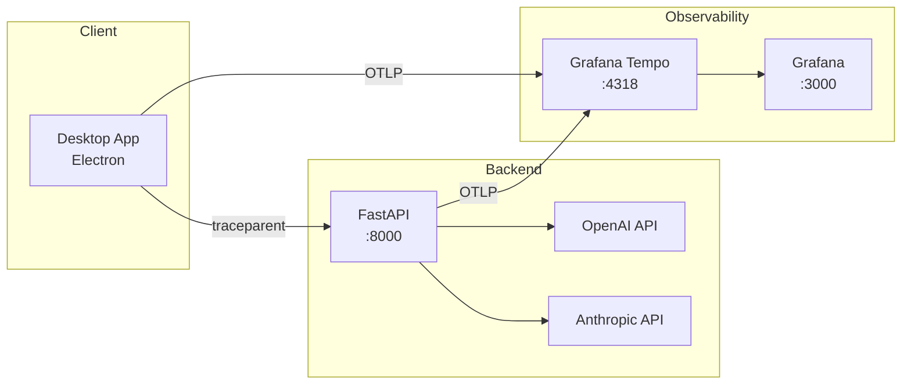

현재 팀에서는 LLM 서비스 관련 프로젝트를 진행하고 있다.

기존에도 `Grafana` - `Prometheus` - `Loki`  기반의 모니터링 스택은 구축되어 있어, 메트릭과 로그 가시성은 어느정도 확보된 상태였다.

다만, 실제 운영 환경에서 더 필요해진 것은, 요청 단위의 흐름을 추적할 수 있는 트레이싱, 그리고 LLM 호출 자체를 들여다 볼 수 있는 관측 도구였다.

특히 LLM 서비스에서는 단순히 API 응답 시간만 보는 것으로는 부족했다. API 요청 시 어떤 파라미터/프롬프트로 LLM 모델이 호출 되었을 때, 얼마나 토큰을 사용 하는지 그리고 얼만큼의 시간 소요가 있었는지 확인할 수 있어야 실제 운영단에서 판단할 수 있는 기준이 많아졌다.

마침 Datadog 측에서 도입 제안이 들어와 검토를 진행했지만,  서버 인스턴스 단위 과금, LLM, Rum 등 전체 비용이 꽤 크게 발생할 것 같았다.

이미 기본적인 Grafana 스택을 운영하고 있는 상황에서, 우선은 상용 SaaS를 바로 도입하기보다 오픈소스 기반으로 직접 구축이 가능한 지 검증해보는 방향이 더 나을 것 같다고 판단했다.

## PoC 목표

이번 PoC 에서는 `요청 트레이싱`과 `LLM 가시성(Observability)`을 함께 구성하는 것을 목표로 잡았다.

요청 트레이싱은 `Tempo`를 사용했다. 기존에 Grafana를 운영중이었기 때문에 같은 Grafana Labs의 툴을 사용하면 연동이 쉬울거라 예상했기 때문이다.

LLM Observability는 `OpenLLMetry` 를 적용해 보았다. `Langfuse` 처럼 더 풍부한 기능을 제공하는 도구들도 있었지만, 이번 PoC 에서 가장 우선순위가 높았던 것은, 요청을 추적하고 그 요청의 파라미터에 따라 LLM 토큰 사용량과 지연 시간을 확인하는 것이었다. 프롬프트 분석 같은 풍부한 기능보다는, 현재 서비스에 필요한 최소한의 LLM 가시성을 빠르게 확보하는 데 초점을 맞췄다.

비용과 운영 복잡도도 중요한 고려 사항이었다. Langfuse는 셀프 호스팅이 가능하지만, ClickHouse 를 포함해 함께 구성해야 할 시스템이 적지 않았다. 이전에 Sentry를 셀프 호스팅 하면서도, 여러 시스템 요소들을 함께 운영해야 했고, 그 과정에서 4 CPU급 워커 노드를 2대 이상 고려해야 할 정도로 리소스 부담이 있었던 경험이 있었다.

이번 PoC 에서는 기존 스택 위에 비교적 가볍게 얹을 수 있고 빠르게 검증 가능한 기술을 선택했다.



## OpenTelemetry / OpenLLMetry

[OpenTelemetry](https://opentelemetry.io/)는 CNCF에서 관리하는 오픈소스 관측 표준으로, `trace`, `metric`, `log` 를 일관된 방식으로 수집하고 전송할 수 있게 해준다.

말 그대로 표준이기에, 애플리케이션 계측 코드를 특정 관측 도구 전용으로 작성하지 않아도 된다는 장점이 있고, 특정 벤더에 종속되지 않는다는 특징이 있다. 즉, 나중에 관측 도구를 바꾸더라도 애플리케이션 계측 코드를 전면 수정하기보다, 대시보드 구성을 조정하는 방식으로 변경할 수 있다는 뜻이다.


[OpenLLMetry](https://github.com/traceloop/openllmetry)는 OpenTelemetry 위에 구축된 LLM 전용 계측 라이브러리다. OpenAI, Anthropic 같은 지원되는 LLM 프레임워크에 대해 자동 계측을 제공하고, 모델 정보, 토큰 사용량, 프롬프트와 같은 LLM 관련 데이터를 OpenTelemetry span 에 담아 기존 관측 스택으로 전송할 수 있게 해준다.

```
OpenLLMetry (LLM 계측)
    ↓
OpenTelemetry (관측 표준)
    ↓
OTLP (전송 프로토콜)
    ↓
백엔드 (Tempo, Jaeger 등)
```

OpenLLMetry 가 생성한 span도 OpenTelemetry 표준을 따른다.

이번 PoC 에서도 이 점을 활용해, LLM 호출 관련 데이터를 Grafana Tempo로 전송해 조회하는 구성을 선택했다. Tempo 역시 OpenTelemetry(OTLP) 기반 수집을 지원하며, trace 조회 기능을 제공한다.

## Grafana Tempo

Tempo는 Grafana Labs 에서 만든 분산 트레이싱 도구다.

이번 PoC에서 Tempo를 선택한 가장 큰 이유는 Grafana 스택과의 연결이 자연스럽기 때문이다. 메트릭은 Prometheus, 로그는 Loki 로 수집하는 기존 스택이 구성되어 있었기에, 트레이스를 Tempo로 붙이면 관측 데이터가 Grafana 안에서 한번에 확인할 수 있기 때문이다.

## 백엔드 구현

LLM 호출이 일어나는 곳이 백엔드이기에 우선 백엔드부터 적용했다.

```python
from traceloop.sdk import Traceloop

Traceloop.init(
    app_name="backend",
    api_endpoint="http://localhost:4318",
)
```

처음에는 OpenLLMetry(Traceloop SDK) 가 자동으로 LLM 호출을 계측해줄 것이라 기대하였다. 실제로 OpenAI나 Anthropic SDK를 쓰면 별도 코드 없이도 트레이스가 생성되는 것으로 문서에 나와 있었다.

하지만 막상 적용해보니 LLM 호출이 트레이스에 잡히지 않았다.

원인은, 우리가 사용하는 API가 비교적 최신 버전(`responses.parse`, `beta.messages.parse`) 이라서 OpenLLMetry가 아직 이 API들을 지원하지 않았기 때문이었다.

자동 계측이 안 되어 수동으로 span 을 생성 하였다.

```python
from opentelemetry import trace
from opentelemetry.trace import SpanKind

tracer = trace.get_tracer("llm.service")

async def call_llm_with_tracing(
    provider: str,
    model: str,
    messages: list[dict],
):
    span_name = f"{provider}.{model}"

    with tracer.start_as_current_span(
        span_name,
        kind=SpanKind.CLIENT,
        attributes={
            "gen_ai.system": provider,
            "gen_ai.request.model": model,
            "gen_ai.operation.name": "chat",
        },
    ) as span:
        response = await client.chat.completions.create(
            model=model,
            messages=messages,
        )

        span.set_attribute("gen_ai.usage.input_tokens", response.usage.prompt_tokens)
        span.set_attribute("gen_ai.usage.output_tokens", response.usage.completion_tokens)

        return response
```

OpenTelemetry는 GenAI Semantic Conventions 라는 표준 속성을 정의하고 있다. `gen_ai.system`, `gen_ai.request.model`, `gen_ai.usage.input_token` 속성을 지정하면, Grafana 에서 모델, 토큰별로 필터링하고 집계할 수 있다.

## 분산 트레이싱

클라이언트의 요청이 백엔드에서 어떻게 처리되었는지를 연결해서 보려면 FE - BE 간 트레이싱이 필요하다.

HTTP 요청에 `traceparent` 헤더를 포함하면 trace가 연결된다.

```tsx
import { NodeTracerProvider } from '@opentelemetry/sdk-trace-node'
import { OTLPTraceExporter } from '@opentelemetry/exporter-trace-otlp-http'
import { trace } from '@opentelemetry/api'

// 트레이서 초기화
const provider = new NodeTracerProvider({
  resource: resourceFromAttributes({
    'service.name': 'service-client',
  }),
  spanProcessors: [new BatchSpanProcessor(new OTLPTraceExporter())]
})
provider.register()

// API 요청 시 traceparent 헤더를 생성해서 전달
function createTraceparentHeader(): string | null {
  const currentSpan = trace.getActiveSpan()
  if (!currentSpan) return null

  const ctx = currentSpan.spanContext()
  return `00-${ctx.traceId}-${ctx.spanId}-01`
}

const headers = {
  'Content-Type': 'application/json',
  'traceparent': createTraceparentHeader()
}
```

BE 에서는 FastAPI Instrumentation 을 추가하면, 들어오는 traceparent 헤더를 자동으로 파싱해 FE 의 trace context 를 이어 받을 수 있다.

```python
from opentelemetry.instrumentation.fastapi import FastAPIInstrumentor

app = FastAPI()
FastAPIInstrumentor.instrument_app(app)
```

이렇게 하면 FE 에서 생성된 span과 BE 에서 생성된 span 이 같은 trace-id 로 묶인다. Grafana 에서 한 요청을 추적하면 FE → BE → LLM 호출까지 전체 흐름을 확인할 수 있게 된다.

### Tempo 대시보드


하나의 요청에서, 여러 LLM 호출이 연결된 전체 trace 화면.

각 호출의 시간을 비교해 병목 구간, 모델 응답 성능을 파악할 수 있다.


Tempo 에서 요청 trace 를 조회한 화면.

PoC 적용 이후, 백엔드 요청이 trace 단위로 Tempo 에 수집되는 것을 확인할 수 있다. 요청 API 이름, 시각 등의 정보로 trace를 검색하고 조회할 수 있다.


LLM 호출 span 에 모델 및 토큰 사용량이 기록된 화면.

LLM 호출 span 에는 provider, model, input/output token 같은 속성을 남겼다. 응답 시간과, 어떤 모델이 어마나 토큰을 사용 했는지도 요청 단위로 확인할 수 있다.

### 마무리

이전에 경험했던 메트릭 정보, 로그 수집 인프라 구성 뿐만 아니라, 이번에 트레이싱 / 관측 인프라를 구성해 보면서 배운 점이 많았다.

AI 서비스 부하 테스트를 하면서도 느꼈지만, 일반적인 웹서비스와 다르게, LLM 플랫폼에 의존적인 AI 서비스는 기존 방식과 다른 시각으로 모니터링 해야 하는 것 같다. (외부 의존적인 다른 서비스들도 마찬가지일 것이다)

일반적인 서비스에서는 보통 응답 시간, CPU/메모리 같은 지표가 우선적인 판단 기준이 되지만, AI 서비스는 요청에서 어떤 모델을 호출 했는지, 모델의 응답 시간은 얼마나 걸렸는지, 토큰은 얼마나 사용 되었는 지 등, 우리 인프라의 정보 뿐만 아니라, 외부의 정보도 있어야 실질적인 운영 모니터링이 가능했다.

또한 이번 PoC 에서 트레이싱을 구축하면서, FE 에서부터 시작된 요청이 BE 를 거쳐, LLM 호출하기까지 하나의 trace 로 연결되어 보인다는 점이 흥미로웠다.
