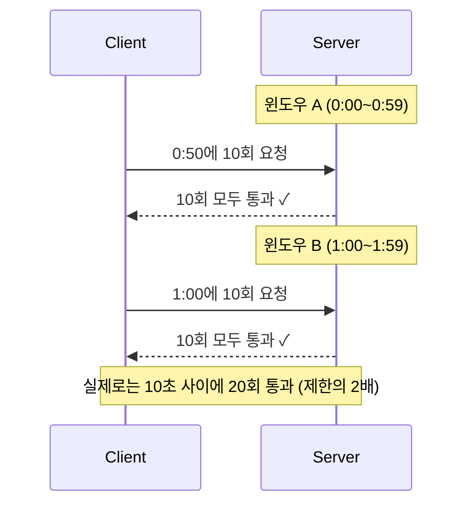
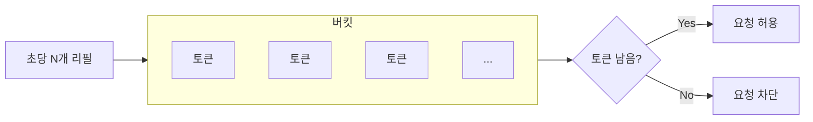
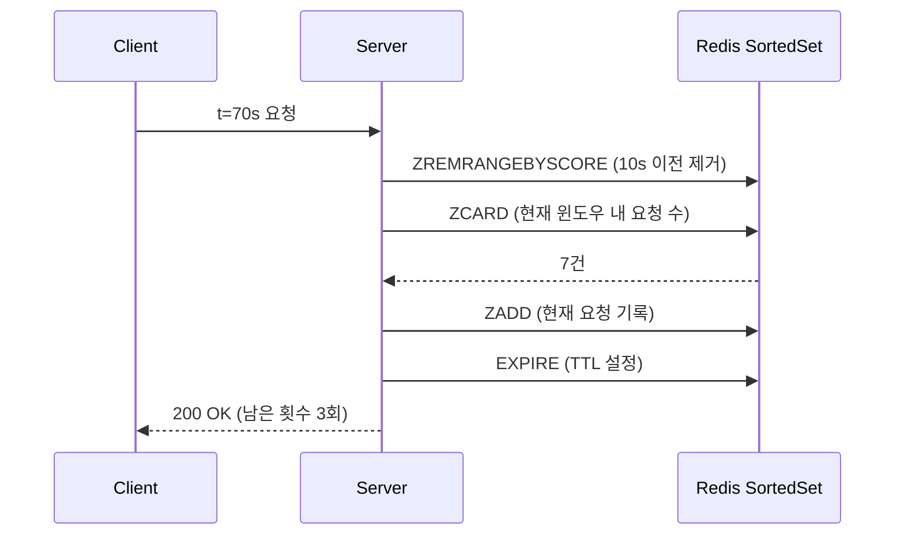

Sentencify 의 핵심 비용 구조는 LLM API 호출이다. 1회 교정 요청 당 여러 LLM을 병렬 호출하는 구조이며, 혹여나 비정상적이거나 악의적인 대량 요청이 들어오면 LLM API 비용이 순식간에 폭증할 수 있는 문제점이 있다.

따라서, 이 문제를 해결하기 위해 사용량 제한 (Rate Limiter) 모듈을 구축하였고, 이 글에서는 해당 내용을 공유하려 한다.

## 설계 목표

- 비용 공격 방어: 비정상적 대량 요청으로 인한 LLM API 비용 폭발 방지
- 분산 환경 일관성: 여러 Pod에서 동일한 제한 공유
- 추후 구독 플랜별 쿼터 시스템으로 확장

## 구현 알고리즘 비교

Rate Limiting을 구현하는 알고리즘은 여러 가지가 있지만, 실무에서 주로 사용되는 세 가지를 비교해 보았다.

### Fixed Window (고정 윈도우)

가장 직관적인 방식이다. 시간을 일정 크기의 구간으로 나누고, 각 구간마다 요청 횟수를 카운팅 한다.

예를 들어, ‘분당 10회 제한’ 이라면, 0:00 ~ 0:59를 하나의 구간(윈도우)으로 보고, 이 안에서 요청이 10회를 넘으면 차단한다. 다음 구간인 1:00 ~ 1:59 가 되면 카운터가 0으로 초기화 된다.

Redis로 구현하면 `INCR` (카운터 1 증가) `EXPIRE` (구간이 끝나면 키 삭제) 두 커맨드면 끝이라, 구현 난이도가 가장 낮다.

하지만 경계 버스트 (boundary burst) 라는 구조적인 문제가 있다. 윈도우 경계에 요청이 몰렸을 때, 각 윈도우 기준으로는 제한을 지킨 것이지만, 실질적으로는 제한을 초과할 수 있다.




비용 보호가 목적이라면 이 허점이 위험하다. 공격자가 의도적으로 윈도우 경계 시점을 노리면 제한이 의도보다 느슨해지기 때문이다.

### Token Bucket (토큰 버킷)

양동이(버킷)에 토큰이 일정 속도로 채워지고, 요청이 들어올 때마다 토큰을 하나씩 소모하는 방식이다. 토큰이 남아 있으면 요청을 허용하고, 토큰이 없으면 차단한다.

장점은 순간적인 버스트(burst)를 유연하게 허용할 수 있다는 것이다. 버킷이 가득 찬 상태라면 짧은 시간에 많은 요청을 보내도 허용되고, 이후 자연스럽게 속도가 조절된다. API Gateway 나 CDN 같은 인프라 레벨에서 트래픽 절감 용도로 사용 된다.



하지만 직접 구현하기에는 부담이 있었다. ‘지금 토큰이 몇 개인가’ 를 계산하려면 마지막 리필 시점, 현재 토큰 수, 리필 속도 등을 조합해야 하는 것 같았고, 이 계산과 토큰 차감이 원자적으로 이루어져야 했으므로, Redis 에서 이를 보장하려면 Lua Script 가 거의 필수적인데, 구현 난이도가 있고 디버깅도 어려울 것 같았다.

우리 서비스는 현재 단순 비용 폭탄만 방지하면 되는 상황이여서 채택하지 않았다.

### Sliding Window Log (슬라이딩 윈도우 로그) ← 채택

각 요청이 들어올 때마다 타임스탬프를 기록해두고, 현재 시점에서 윈도우 크기만큼 과거를 조회하여 그 범위 안에 있는 요청 수를 세는 방식이다.

Fixed Window처럼 구간을 미리 고정해 놓는 것이 아니라, 요청이 들어온 바로 그 시점을 기준으로 윈도우를 계산한다. 시간 축에 따라 윈도우도 자연스럽게 이동하는 방식이다.



Fixed Window 의 경계 버스트 문제가 원천적으로 발생하지 않는다. 어느 시점에서 요청이 들어오든, 항상 ‘직전 60초’ 구간을 정확히 체크하기 때문이다. 그리고 남은 횟수 계산도 직관적이다. 윈도우 안의 요청 수를 세서 제한에서 빼면 된다.

Redis 구현도 쉽다. Redis 에는 Sorted Set 이라는 자료구조가 있는데, 각 멤버(member)에 점수(score) 가 붙어 점수 기준으로 자동 정렬된다. 이 때, 요청 타임스탬프를 score로, 요청 Id 를 member로 저장하면,

`ZREMRANGEBYSCORE` (윈도우 밖 제거) → `ZCARD` (현재 수 조회) → `ZADD` (새 요청 기록) → `EXPIRE` (TTL 설정) 네 커맨드를 pipeline으로 묶어 네트워크 왕복 1회로 처리할 수 있다.


## 설계

LLM을 호출하는 Post API 요청에 제한을 걸기 위해 policy.py 를 작업 하였다.


```python
def resolve_policy(path: str, method: str) -> list[RateLimitPolicy]:
    if method != "POST":
        return []

    if _match_path(path, "/sentence/operation"):
        return [OPERATION_POLICY, OPERATION_DAILY_POLICY]

    if _match_path(path, "/sentence/spellcheck"):
        return [SPELLCHECK_POLICY, SPELLCHECK_DAILY_POLICY]

    return []
```

### 분당 + 일별 이중 제한
엔드포인트별로 분당 + 일별 이중 제한을 뒀다.

| 엔드포인트 | 비용 구조 | 분당 | 일별 |
|-----------|----------|------|------|
| 교정 API (다중 LLM 병렬) | 높음 | 100회 | 10,000회 |
| 맞춤법 API (단일 LLM) | 중간 | 150회 | 20,000회 |
| 그 외 (조회 등, GET 요청) | 없음 | 제한 없음 | 제한 없음 |

일별 쿼터는 비용 폭발 방지 안전망이다. 플랜별 사용량 제한이 아니라 자동화 공격 시 비용 상한선 역할이므로, 정상 사용자는 도달하지 않을 수준으로 잡았다.

```python
@dataclass(frozen=True)
class RateLimitPolicy:
    requests: int
    window_seconds: int
    window_label: str  # 응답 헤더에서 윈도우를 구분하는 용도

OPERATION_POLICY = RateLimitPolicy(
    requests=100, window_seconds=60, window_label="Minute"
)
OPERATION_DAILY_POLICY = RateLimitPolicy(
    requests=10000, window_seconds=86400, window_label="Daily"
)
```

### Fail-Open

Redis 장애 시 Fail-Close(모든 요청 차단)와 Fail-Open(모든 요청 허용) 중 선택해야 한다.

Fail-Open을 선택했다. Rate Limiting은 보호 장치이지 핵심 비즈니스 로직이 아니다. Redis가 죽었다고 서비스까지 다운 될 필요가 없었다.

```python
redis_client = self._redis.client
if redis_client is None:
    logger.warning("[Rate Limit] Redis not connected - fail-open")
    return RateLimitResult(
        allowed=True, limit=policy.requests,
        remaining=policy.requests, retry_after_seconds=None,
    )
```

## 구현

### 핵심 알고리즘

4개의 Redis 커맨드를 Pipeline으로 묶어 네트워크 왕복 1회로 실행한다.

```python
pipe = redis_client.pipeline()
pipe.zremrangebyscore(key, 0, window_start_ms)  # 1) 윈도우 밖 제거
pipe.zcard(key)                                  # 2) 현재 수 조회
member = f"{now_ms}:{uuid.uuid4().hex[:8]}"
pipe.zadd(key, {member: now_ms})                 # 3) 현재 요청 기록
pipe.expire(key, policy.window_seconds + 10)     # 4) TTL 갱신
results = await pipe.execute()
```

member에 UUID를 붙이는 이유는, 동일 밀리초에 들어온 요청이 서로 다른 member로 기록되어야 하기 때문이다. 타임스탬프만 쓰면 같은 시각의 요청이 하나로 합쳐진다.

`ZCARD` 결과(추가 전 카운트)가 허용량 이상이면, 방금 추가한 요청을 `ZREM`으로 제거하고 429를 반환한다.

```python
current_count = results[1]

if current_count >= policy.requests:
    await redis_client.zrem(key, member)
    return RateLimitResult(
        allowed=False, limit=policy.requests,
        remaining=0, retry_after_seconds=policy.window_seconds,
    )

remaining = policy.requests - current_count - 1
```

Sliding Window에서는 "리셋 시점"이라는 개념이 없기 때문에, `retry_after_seconds`에는 윈도우 크기를 그대로 반환한다.

### Pipeline과 원자성

Pipeline은 네트워크 왕복을 줄여줄 뿐, 원자적 실행을 보장하지 않는다. 완벽한 원자성이 필요하면 Lua Script로 묶어야 한다.

현재 트래픽 수준에서 경쟁 조건으로 인한 오차는 1~2회 수준으로 적을 것이라 판단하였다.

### 키 설계

```
rate_limit:{identifier}:{endpoint_group}:{window_seconds}

rate_limit:user:660a1b2c:operation:60       # 사용자별 교정 분당
rate_limit:user:660a1b2c:operation:86400    # 사용자별 교정 일별
rate_limit:ip:203.0.113.42:spellcheck:60    # IP별 맞춤법 분당
```

`window_seconds`를 키에 포함시켜 분당/일별 제한이 서로 다른 Sorted Set에 저장되도록 했다. 모든 키에 `EXPIRE`를 설정하므로 별도 cleanup이 불필요하다.

### 사용자 식별

인증된 사용자는 user_id, 비인증은 IP 기반으로 식별한다. IP는 프록시 환경을 고려해 `x-real-ip` → `x-forwarded-for` → `request.client.host` 순으로 추출한다.

```python
def _get_identifier(request: Request) -> str:
    user_id = getattr(request.state, "user_id", None)
    if user_id:
        return f"user:{user_id}"

    ip = request.headers.get("x-real-ip")
    if not ip:
        forwarded_for = request.headers.get("x-forwarded-for")
        if forwarded_for:
            ip = forwarded_for.split(",")[0].strip()
    if not ip:
        ip = request.client.host if request.client else "unknown"
    return f"ip:{ip}"
```

### 응답 헤더

정책별로 Rate Limit 상태를 헤더에 내려보낸다. 정책 Class의 `window_label` 속성을 활용해 어떤 윈도우의 제한인지 명시한다.

```http
X-RateLimit-Operation-Minute-Limit: 100
X-RateLimit-Operation-Minute-Remaining: 97
X-RateLimit-Operation-Daily-Limit: 10000
X-RateLimit-Operation-Daily-Remaining: 9997
Retry-After: 61  (429 응답 시에만)
```


## 미들웨어 통합


Rate Limiter가 Auth 이후에 실행되어야 `request.state.user_id`를 식별자로 사용할 수 있다. FastAPI는 미들웨어를 역순으로 실행하므로 등록 순서에 주의해야 한다.


## 마무리

이번 작업의 핵심은 LLM 비용 보호였다. 보통 Rate Limiting이라 하면 DDoS 방어를 떠올리기 쉬운데, 작업을 진행하면서 사용량 제한에도 여러 레이어가 있다는 걸 구체적으로 정리할 수 있었다.

- 인프라 레벨: DDoS 방어 (WAF, CDN 등)
- 애플리케이션 레벨: 비용 보호, 플랜별 쿼터 등

이 둘은 별개의 레이어이고, 이번에 구현한 건 애플리케이션 레벨의 비용 보호에 해당한다.

구현 자체는 Redis Sorted Set의 score 기반 연산이 Sliding Window와 잘 맞아서 어렵지 않았다. 오히려 어려웠던 건 정책적 결정이었다. POST만 제한할 것인지, 제한 수치를 얼마로 잡을 것인지, Redis 장애 시 어떻게 할 것인지 — 이런 판단들이 코드 작성보다 시간이 걸렸다.

변경 범위는 신규 파일 5개(약 200줄)와 기존 파일 수정 2개(약 10줄)로, 기존 코드에 영향 없이 미들웨어 추가만으로 적용되었다.

향후에는 플랜별 쿼터 (`resolve_policy`에 사용자 플랜 파라미터 추가), Prometheus 메트릭 노출, 트래픽 증가 시 Lua Script 전환 등을 고려하고 있다.
