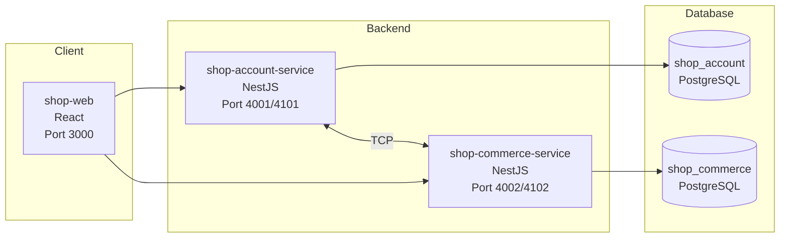
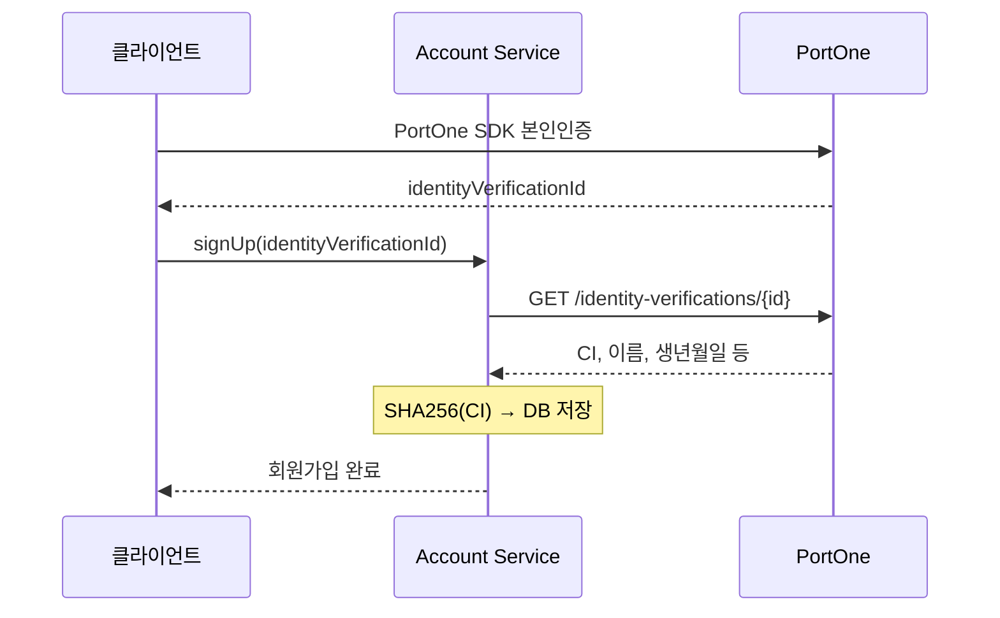
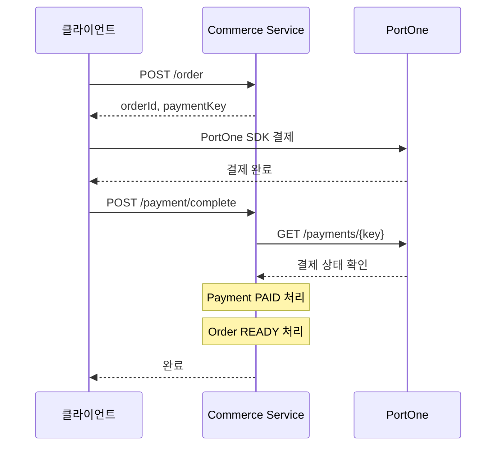

이전에 실무에서 커머스 도메인을 담당했던 경험을 다시 정리해보고 싶어서, 작은 쇼핑몰 프로젝트를 직접 개발해 보았다.

단순 기능 구현이 아니라, 실제 운영에서 주의해야 하는 부분(결제/주문 정합성)을 프로젝트에 반영하려 하였다.

## 기술 스택

- Frontend: React
- Backend: NestJS
- 내부 통신: NestJS Microservices (TCP)
- Database: PostgreSQL + Prisma ORM
- Payment / Identity Verification : PortOne

## 프로젝트 구조



- shop-account-service: 회원 도메인. 회원가입/로그인, 본인인증
- shop-commerce-service: 커머스 도메인. 상품, 장바구니, 주문, 결제

시스템에서 각 도메인을 역할에 따라 분리하였다. 또한 각 서비스는 독립 DB와 연결되어 있으며, 내부 통신은 TCP 기반 RPC 형태로 구현하였다.

## 회원가입 / 본인인증

쇼핑몰에서 본인인증이 필요한 경우가 많다. 

이 프로젝트에서도 PortOne 을 이용해 본인인증 기능을 구현 하였다.

### 본인인증 플로우



1. 클라이언트에서 PortOne SDK 로 본인인증 진행
2. 인증 완료 후 identityVerificationId 획득
3. 회원가입 API 호출 시 이 Id 를 함께 전송
4. 백엔드에서 PortOne API 로 인증 결과 조회
5. CI 를 해싱하여 저장

### CI(연계정보) 해싱

CI 는 개인을 고유하게 식별하는 값이다. 주민등록번호를 대체하는 용도로, 동일인이면 어느 서비스에서 인증해도 같은 CI 가 나온다.

문제는 CI 자체가 민감 정보라는 것이다. 원본 CI 를 저장하면 DB 유출 시 개인 식별이 가능해진다. 그래서 원본 CI 를 DB에 저장하지 않고, 해싱 후 저장하였다.

```tsx
// 회원가입 시 CI 처리
const verificationData = await this.verificationService.identityVerification(identityVerificationId);
const customer = verificationData.verifiedCustomer;

// 원본 CI를 저장하지 않고, 해시만 저장
await this.accountRepository.createAccount({
  data: {
    loginId: data.loginId,
    encryptPassword: await hashPassword(data.password),
    user: {
      create: {
        name: customer.name,
        hashedCi: sha256Hash(customer.ci),  // SHA256 해싱
        birth: new Date(customer.birthDate),
      },
    },
  },
});
```

## 주문 / 결제

쇼핑몰에서 가장 중요한 부분이 결제다. 결제 기능은 절대로 틀리면 안되는 영역이다.

클라이언트의 ‘결제 완료’ 시, 클라이언트의 요청만 신뢰하지 않고, 백엔드에서 한번 더 검증하도록 하였다.

결제 완료 처리에서 Payment / Order 상태 변경은 원자적이어야 하며, 결제 완료 처리를 중복 호출 / 재시도 하여도 멱등성이 보장되어야 한다.

결제 완료 API는 중복 호출될 수 있다.

클라이언트 단에서 사용자 입력에 따라 완료 버튼이 두번 눌린다던지, 네트워크 타임아웃 등으로 클라이언트의 재시도, 또한 웹훅으로 완료 호출이 중복될 수 있다.

그래서 `paymentKey` 기준으로 한 번 처리된 결제는 다시 처리하지 않도록 멱등성을 보장했다.

### 결제 플로우



### 결제 검증

클라이언트에서 ‘결제 완료’를 알려줘도 무조건 신뢰하지 않고, 서버에서 PortOne API 를 호출해 실제 결제 여부를 확인한다.

```tsx
@Injectable()
export class PortOneService {
  constructor(private readonly configService: ConfigService) {}

  async getPortOnePayment(paymentKey: string): Promise<PortOnePayment> {
    const response = await fetch(
      `https://api.portone.io/payments/${encodeURIComponent(paymentKey)}?storeId=${this.configService.getOrThrow('PORTONE_STORE_ID')}`,
      {
        headers: {
          Authorization: `PortOne ${this.configService.getOrThrow('PORTONE_API_KEY')}`,
        },
      },
    );

    if (!response.ok) {
      throw new InternalServerErrorException('Failed to get payment info');
    }

    return await response.json();
  }

  async validatePaidPortOnePayment(paymentKey: string) {
    const portOnePayment = await this.getPortOnePayment(paymentKey);

    if (portOnePayment.status !== 'PAID') {
      throw new InternalServerErrorException('Payment is not paid');
    }

    return portOnePayment;
  }
}
```

### 트랜잭션 - 결제 완료 처리 원자성

일반적으로 결제 완료 처리 시, 여러 테이블의 데이터를 동시에 업데이트 하게 된다.

이 프로젝트에서는 `Payment - PAID`, `Order - READY` 와 같이 상태를 업데이트 한다.

둘 중 하나만 성공하면 절대 안된다. `Payment`는 `PAID` 인데 `Order` 가 `PENDING` 이면 고객은 결제 했는데 주문이 처리되지 않은 상황이 발생한다.

이 프로젝트에서는 NestJS CLS(Continuation Local Storage)와 Prisma 를 연동해, `@Transactional()` 데코레이터로 트랜잭션을 처리했다.

```tsx
@Transactional()
async completePayment(customerId: number, paymentKey: string) {
  // 1. PortOne에서 실제 결제 여부 확인
  await this.portOneService.validatePaidPortOnePayment(paymentKey);

  // 2. Payment 조회
  const payment = await this.paymentRepository.findPayment({
    where: { paymentKey },
  });

  // 3. 본인 주문인지 확인
  if (payment.customerId !== customerId)
    throw new ForbiddenException('not allowed');

  // 4. 이미 처리된 결제인지 확인 (멱등성)
  if (payment.status === PaymentStatus.PAID) return true;

  // 5. PENDING 상태가 아니면 에러
  if (payment.status !== PaymentStatus.PENDING)
    throw new InternalServerErrorException('Invalid payment status');

  // 6. Payment 상태 업데이트
  await this.paymentRepository.updatePayment({
    where: { id: payment.id },
    data: { status: PaymentStatus.PAID, paidAt: new Date() },
  });

  // 7. Order 상태 업데이트
  await this.orderService.updateOrderAsReady(payment.orderId, customerId);

  return true;
  // 예외 발생 시 6, 7 모두 롤백됨
}
```

### 주문 시점 스냅샷

주문 후에 상품 가격이 바뀌면, 주문 내역이 왜곡될 수 있다.

그래서 OrderItem 에 주문 시점의 상품명/가격을 저장해 주문 이력을 고정했다.

```
model OrderItem {
  id           Int     @id @default(autoincrement())
  orderId      Int     @map("order_id")
  productId    Int     @map("product_id")
  productName  String  @db.VarChar(50)   // 주문 시점의 상품명
  productPrice Int     @db.Integer       // 주문 시점의 가격
  quantity     Int

  order   Order   @relation(fields: [orderId], references: [id])
  product Product @relation(fields: [productId], references: [id])
}
```

## MSA 아키텍처

서비스 간 통신에 REST 대신 TCP 를 선택했다.

외부 공개 API 가 아니라 내부 RPC 통신으로 구현하도록 하고 싶었고, `NestJS Microservices` 에서 제공하는 `cmd` 패턴으로 빠르게 구성이 가능 했기 때문이다.

```tsx
// Commerce Service에서 Account Service 호출
@Injectable()
export class AccountClientService {
  constructor(
    @Inject('ACCOUNT_SERVICE') private readonly client: ClientProxy,) {}

  async getUserInfo(accountId: number) {
    return await firstValueFrom(
      this.client.send({ cmd: 'account.get-user-info' }, { accountId }),
    );
  }
}
```

```tsx
// Account Service에서 메시지 수신
@Controller()
export class AccountController {
  @MessagePattern({ cmd: 'account.get-user-info' })
  async getUserInfo(@Payload() data: { accountId: number }) {
    return await this.accountService.getMe(data.accountId);
  }
}
```

## 마무리

이번 쇼핑몰 프로젝트를 개발하면서, 실무에서 경험 했던 것들을 다시 한번 정리할 수 있었다.

특히 결제 기능은 금전이 직접 오가는 영역이라 오류 발생 시 큰 문제로 이어질 수 있다.

그래서 구현할 때는 ‘정상 동작’ 보다 ‘실패 / 재시도 / 중복 호출’ 을 먼저 가정하고 방어하는 관점이 중요했다.

## 스크린샷


메인 페이지 1 (배너)


메인 페이지 2 (메인 상품)


제품 상세 화면


회원가입 / 본인인증


장바구니 화면


주문 / 결제 화면


주문 내역 화면